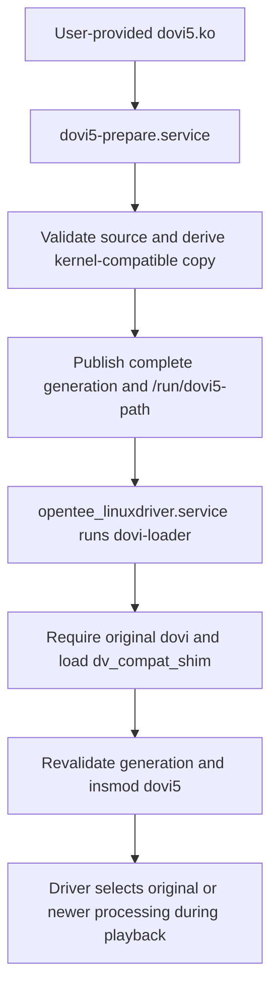

# Loading the newer Dolby Vision module in p3i

This describes the Amlogic-ng / S922X-J path as inspected on 2026-10-09.
The working directory is `/storage/.dovi5/`. It contains a prepared,
kernel-specific copy of the user-provided module; the supplied file is preserved.
The directory is unrelated to Kodi's `/storage/.kodi/` profile.

The broad sequence comes from avdvplus R10: prepare the newer module, retain
original Dolby processing, and load the newer module through a compatibility
shim. p3i changes the preparation, validation, caching and failure handling.

## From the supplied file to playback



1. **Locate the supplied module.** Preparation tries
   `/storage/.config/dovi5.ko`, `/flash/dovi5.ko`, then `/storage/dovi5.ko`.
   It tries another candidate after rejecting one. The current implementation
   accepts one exact, unmodified source SHA-256 fingerprint. CE does not ship or
   download this proprietary blob.

2. **Prepare it before the loader runs.** `dovi5-prepare.service` is a boot-time
   oneshot, ordered after local filesystems and DTB auto-update, and before
   `opentee_linuxdriver.service`. It executes
   `/usr/lib/coreelec/dovi5-prepare prepare`. It does not call `insmod`.
   `/storage/.config/dovi5.conf` overrides the packaged `/etc/dovi5.conf`;
   `ENABLE=yes` is the default and `ENABLE=no` prevents preparation and load
   validation. Configuration parsing is strict.

3. **Construct a target-compatible copy.** The supplied newer blob targets a
   different kernel interface. Preparation reads the installed
   `dv_compat_shim.ko` as a native layout reference, the packaged
   `/usr/lib/coreelec/dovi5-Module.symvers`, the running kernel release, and
   built-in exports from `/proc/kallsyms`. It verifies that these agree.
   Supported CE overlay symlinks may be resolved for the input reference.
   Prepared output paths and their parent directories must not be symlinks.

   The patcher reconstructs the native module layout and initialization/exit
   relocations, updates compatibility metadata, names the module `dovi5`, and
   redirects registration to the shim. It replaces the supported blob's
   profiled per-task stack-canary accesses with accesses to the shim's guard.
   It rebuilds symbol-version records from the target CRCs; it does not disable
   the kernel's module-version checks. The proprietary processing code is not
   rebuilt from source, and these checks do not prove all opaque code behavior.

4. **Publish one complete generation.** Preparation uses a lock, writes the
   output and manifest into a temporary directory, flushes them to disk, and
   renames that directory into place. It verifies the completed generation
   before atomically writing its path to `/run/dovi5-path`. The original supplied
   file and `/flash` are not modified. A preparation-service success message
   alone does not establish that the module was loaded; optional rejection can
   deliberately leave boot proceeding with original Dolby processing.

5. **Load original Dolby processing first.** `opentee_linuxdriver.service` runs
   before Kodi. It executes `tee-loader start`, then `dovi-loader start`.
   The NG loader recognizes an already-loaded original module or tries
   `/storage/.config/dovi.ko`, `/flash/dovi.ko`, `/storage/dovi.ko`, then the
   Android vendor module locations (`dovi.ko` or `dovi_vs10.ko`). It stops the
   optional newer-module path if no original module was successfully loaded.
   It then requires a successful `modprobe dv_compat_shim`.

6. **Validate again immediately before loading.** The loader calls
   `dovi5-prepare validate-load`. That operation derives the expected result
   again from current inputs, verifies `/run/dovi5-path`, and requires the
   generation's module and manifest to match the canonical result byte for
   byte. It rechecks the source and enable state before returning a path.
   Only that returned generation is passed to `insmod`. Failure retains the
   original module rather than loading an unchecked optional candidate.

7. **Register and select processing at runtime.** The loaded `dovi5` module
   registers through `dv_compat_shim`. The shim validates the supported callback
   table and adapts the newer metadata parser and multi-control interface to
   the 4.9 driver's interface. Original `dovi` remains loaded and continues to
   supply required legacy integration, including decoder-side parsing.
   Both modules coexist; the driver selects processing for the actual route.

   Current newer-backend eligibility includes registered, usable processing on
   G12B, native Dolby Vision content, Dolby Vision output, VP0, supported signal
   range, and valid output geometry/refresh at no more than 50 Hz. Eligible
   display-led and player-led routes can use it. Conversion, other VP modes,
   higher/unknown refresh and newer processing rejected or returning an error to
   the driver retain original processing. CFI and stack-check violations are
   fatal; they are not recoverable fallback cases.
   Kodi enables automatic eligible routing; there is no newer-backend GUI toggle.

## Why `/storage/.dovi5/generations/<hash>/` exists

The generated layout is:

```text
/storage/.dovi5/
    generations/
        <generation hash>/
            dovi5.ko
            state.json
```

The generation hash is the SHA-256 of a manifest containing the supplied blob's
hash, native shim-reference hash, kernel release, `Module.symvers` hash, built-in
export-name-set hash, patcher hash, preparation-script hash, stack-canary profile
hash, and prepared output hash. Kernel addresses are not part of that export-set
hash. A generation identifies an exact preparation result, not just a Dolby
version or a kernel-release string.

This provides three concrete properties:

- **Compatibility follows the actual inputs.** A changed shim, symbol CRC set,
  patcher or profile can create a new generation even when the kernel release
  string is unchanged. An old generation is not accepted merely because its
  filename is still `dovi5.ko`.
- **The module and its manifest are published together.** The load marker is
  written only after that pair is complete. The loader verifies the pair again.
- **Existing generations remain separate.** A new result does not overwrite a
  previously prepared file. Identical inputs reuse a generation after checking
  its contents. The current code does not automatically prune older generations.

The kernel does not require these directories. A single-file cache could provide
similar behavior with equivalent compatibility validation and atomic publication.
The versioned layout makes those relationships explicit. In p3i, removing the
supplied source also prevents load validation; an old generation alone is not
an independently provisioned replacement.

## Preparation, loading and active use are different states

`/run/dovi5-path` identifies the selected **prepared candidate**.
After successful `insmod`, the loader records the actual loaded file under
`/run/dovi5-loaded-path`; original module loading uses `/run/dovi-loaded-path`.
The loader clears stale records for absent modules and retains them if unloading
fails. The runtime records do not replace the kernel's module-residency checks.

Kodi's System Information → Video reports `dovi.ko` and `dovi5.ko` residency and
recorded load paths independently of playback. A loaded module without a reliable
path record displays an unknown path.

For playback, `Player.Process(amlogic.dv.backend.available)` reports registered
newer-backend capability. `Player.Process(amlogic.dv.backend)` reports the scoped,
observed applied backend (`dovi` or `dovi5`), with an empty value when unknown or
outside the supported playback lifetime. Neither module residency nor successful
preparation establishes that the newer backend is currently processing video.

## Differences from the R10 method used for this port

This comparison is pinned to R10 CoreELEC
[`55282781e6cfd4886208efc0681ffe593be7d254`](https://github.com/avdvplus/CoreELEC/tree/55282781e6cfd4886208efc0681ffe593be7d254)
and kernel
[`fb3ddc33631576a725322e2fd53aff03f4f626b8`](https://github.com/avdvplus/linux-amlogic/tree/fb3ddc33631576a725322e2fd53aff03f4f626b8),
the donor revisions recorded by the implementation commits. It makes no claim
about subsequent avdvplus changes.

| Area | R10 at the pinned revision | Current p3i |
| --- | --- | --- |
| Overall sequence | Separate preparation service, original module, shim, newer module; supplied file preserved. | Same broad design and same three newer-module search locations. |
| Accepted source | Checks recognizable ELF/module structure and registration symbols; can accept already-patched input. | Requires the exact supported unmodified source fingerprint and derives one canonical result. |
| Compatibility patch | Adjusts vermagic, module name, dependencies and init/exit offsets using the reference module. | Reconstructs the native module layout and relocations, then adapts metadata, registration and profiled stack-guard accesses. |
| Symbol versions | Sets the `__versions` section size to zero. | Rebuilds and retains target CRC records using the image's `Module.symvers`. |
| Import checks | Checks kernel/shim exports when enough kernel exports are readable; otherwise explicitly skips that link check. | Requires readable built-in exports, valid import owners and matching target/reference CRCs. |
| Cache layout | One `/storage/.dovi5/dovi5.ko` plus `/storage/.dovi5/state`, recording source, shim and output hashes. | Separate generations with a manifest binding the additional compatibility and patching inputs. |
| Publication | Renames the prepared module into the fixed output path, then writes its stamp and publishes the load path. The module replacement itself is atomic. | Publishes the complete module/manifest directory together, then publishes the selected path. |
| Load-time validation | Checks the preparation stamp's output hash, fixed prepared pathname, resolved path and hard-link count. | Re-derives the canonical result and checks the full generation, current source and enable state again. |
| Missing or rejected new source | Can publish and load a previously prepared copy if its output/shim checks pass. | Requires a currently accepted supplied source; otherwise retains original processing. |
| `ENABLE=no` | Prevents new preparation in the main source-processing path, but can still publish an existing prepared copy. | Prevents preparation and load validation of the optional backend. |
| Original/shim loading | Attempts original loading; invokes shim loading at script startup without requiring its success before entering the loader. | Explicitly requires original residency and successful shim loading before optional load validation. |
| Shim failure handlers | CFI, CFI-abort and stack-check handlers log/count and return. | Retains typed CFI checks and fatal failure behavior; uses an explicit profiled stack guard. |
| Runtime route | Prefers newer processing for Dolby Vision input/output, VP0 and refresh at or below the configured limit (50 Hz by default); can substitute the other backend when the preferred one is absent. | Keeps that broad route, including eligible display-led and player-led output, with explicit original/newer registration, native-source, G12B, signal-range and geometry checks. |
| Refresh eligibility | Uses integer division; unknown refresh becomes zero and fractional rates above the limit can round down. | Requires valid refresh data and compares the rational rate without truncation. |
| User diagnostics | Preparation log with rotation and a notification service/timer. | Preparation/loader journal messages, successful load-path records and Kodi module/backend reporting. The R10 notification service was not ported. |

The common functionality is coexistence of original and newer Dolby processing.
The differences above concern compatibility, cache identity, publication,
validation, route eligibility and diagnostics. They do not by themselves
establish better picture quality, cadence or HDMI behavior. Runtime acceptance still depends on the
supported blob, adapter, driver, playback route and device.

## Source references

The p3i references below are pinned to the inspected source revisions:

- [Preparation service and Python implementation](https://github.com/pannal/CoreELEC/tree/5c71e999bd/projects/Amlogic-ce/packages/linux-drivers/amlogic/dovi5-prepare).
- [Loader and service](https://github.com/pannal/CoreELEC/tree/5c71e999bd/projects/Amlogic-ce/packages/linux-drivers/amlogic/opentee_linuxdriver).
- [Kernel adapter](https://github.com/pannal/linux-amlogic/blob/c7a772e81779/drivers/amlogic/media/enhancement/amdolby_vision/dv_compat_shim.c) and [runtime route eligibility](https://github.com/pannal/linux-amlogic/blob/c7a772e81779/drivers/amlogic/media/enhancement/amdolby_vision/dv_backend.h).
- [Kodi module reporting](../xbmc/windows/GUIWindowSystemInfo.cpp) and [backend reporting](../xbmc/utils/AMLUtils.cpp), inspected at Kodi `fee1ef4589`.

The R10 comparison was checked against:

- [Preparation service/script and patcher](https://github.com/avdvplus/CoreELEC/tree/55282781e6cfd4886208efc0681ffe593be7d254/projects/Amlogic-ce/packages/sysutils/dovi5-prepare).
- [Loader](https://github.com/avdvplus/CoreELEC/blob/55282781e6cfd4886208efc0681ffe593be7d254/projects/Amlogic-ce/packages/linux-drivers/amlogic/opentee_linuxdriver/scripts/dovi-loader.sh).
- [Compatibility shim](https://github.com/avdvplus/linux-amlogic/blob/fb3ddc33631576a725322e2fd53aff03f4f626b8/drivers/amlogic/media/enhancement/amdolby_vision/dv_compat_shim.c).
- [Runtime backend selection](https://github.com/avdvplus/linux-amlogic/blob/fb3ddc33631576a725322e2fd53aff03f4f626b8/drivers/amlogic/media/enhancement/amdolby_vision/amdolby_vision.c#L6118).
